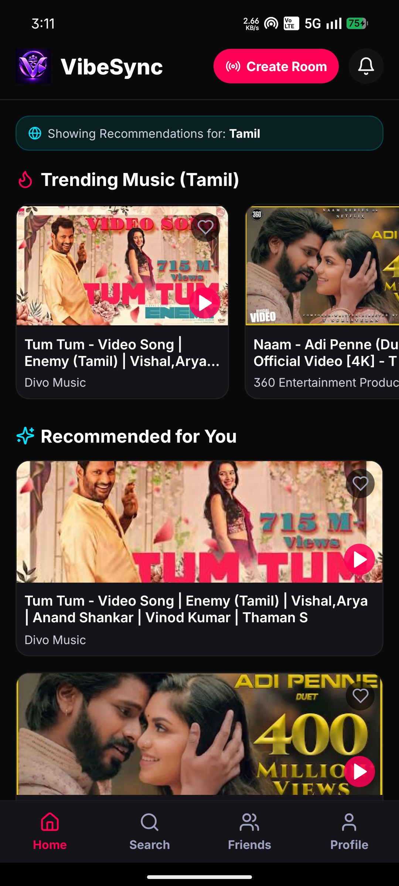
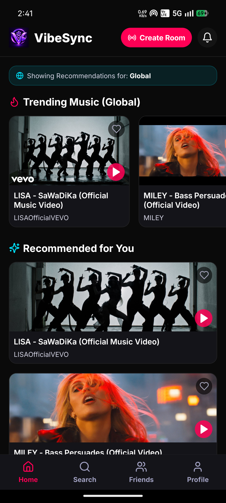
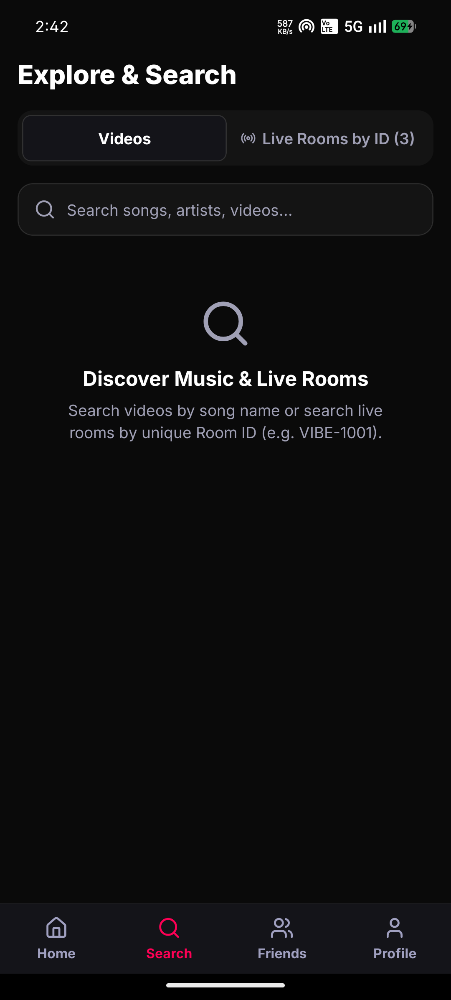
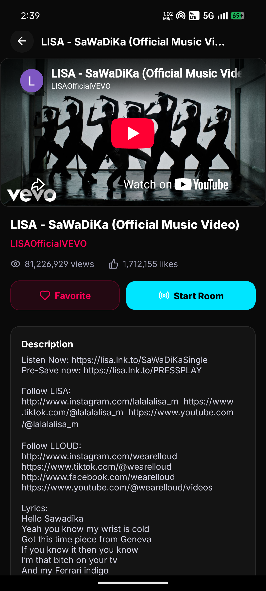
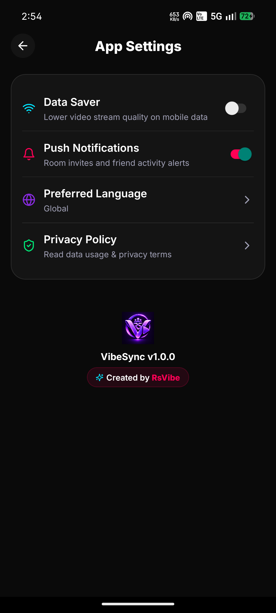
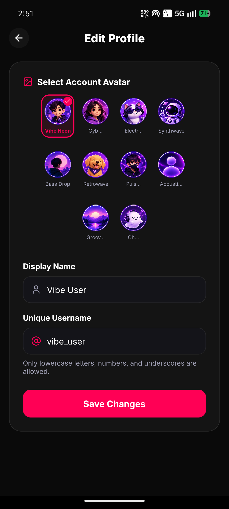
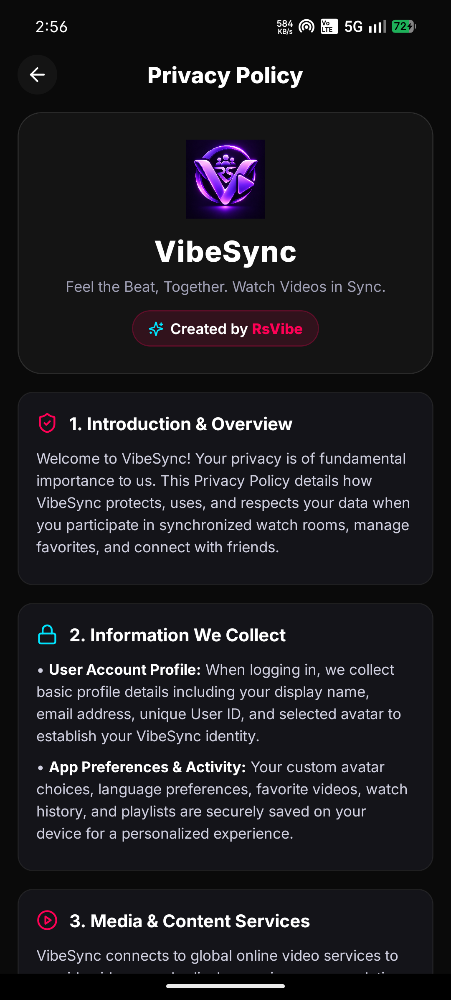

  

<h1 align="center">VibeSync 🎵</h1>

  
  
  
  
  

  <strong>VibeSync</strong> allows friends and couples to watch YouTube videos and listen to music together with real-time synchronized playback, interactive room chat, and multi-controller freedom.

  <em>"Feel the Beat, Together. Watch YouTube videos in sync with friends."</em>

---

## 🌟 Features

- 🎬 **Watch Together** — Stream and watch YouTube content together in synchronized virtual rooms.
- 🎵 **Listen Together** — Enjoy songs and music playlists in perfect real-time sync.
- ⚡ **Real-Time Playback Synchronization** — Automatic synchronization for play, pause, seek, and video changes.
- 🎮 **Multi-Controller Freedom** — Every room participant can control playback without permission requests or host bottlenecks.
- 🔎 **YouTube Search** — Discover YouTube videos, music, and trending content directly inside the application.
- 🏠 **Searchable Unique Rooms** — Create or join public/private rooms with unique IDs (`VIBE-XXXX`).
- 🪟 **In-App Mini Player** — Continue playback smoothly while navigating across different tabs and screens.
- 👤 **Predefined Account Avatars** — Express yourself with 10 vibrant VibeSync avatars without needing photo uploads.
- 🔥 **Firebase Powered** — Secure authentication and real-time database sync for instant updates.
- 📶 **Low Data Consumption** — Smart debounced events and local caching to minimize network usage.
- 🌙 **OLED Dark-First Theme** — Dynamic purple gradients, subtle glows, and high-contrast UI tailored for modern mobile displays.

---

## 📥 Download APK

Download the latest release of **VibeSync** for Android:

  

**🔗 [https://github.com/S-G-Rathenesh/VibeSync/releases/latest](https://github.com/S-G-Rathenesh/VibeSync/releases/latest)**

### Installation Instructions

1. Download the APK file from the Releases link above.
2. Allow **"Install from Unknown Sources"** on your Android device if prompted.
3. Install and open **VibeSync**.
4. Sign in with Google or continue to the main screen.
5. Create or join a watch room (`VIBE-XXXX`) and start enjoying videos together!

---

## 📸 Screenshots

  
  
  

  
  
  
  

  

---

## 🔒 Privacy Policy

We prioritize user data privacy and security. Read our full privacy policy:

📄 **[Privacy Policy → PRIVACY_POLICY.md](PRIVACY_POLICY.md)**

---

## 📄 License

This project is licensed under the **MIT License** — see the [LICENSE](LICENSE) file for details.

---

  Developed with ❤️ by <strong>RsVibe</strong> (S.G. Rathenesh)

